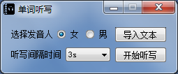
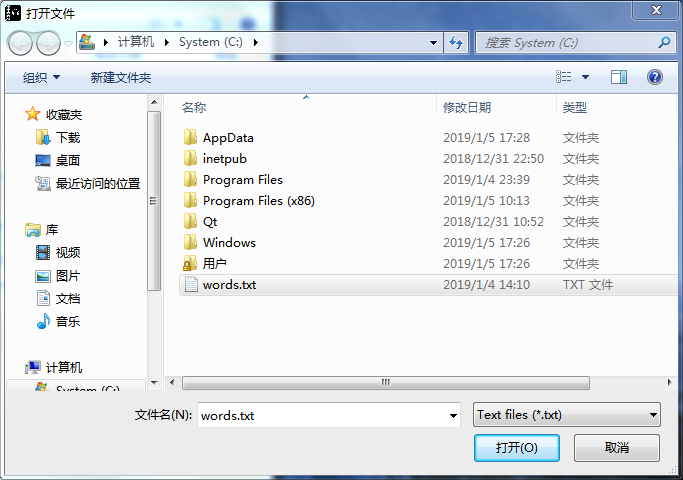
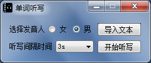
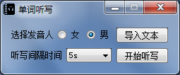
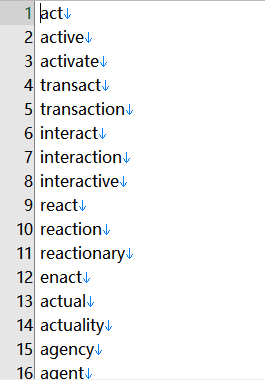
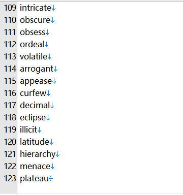
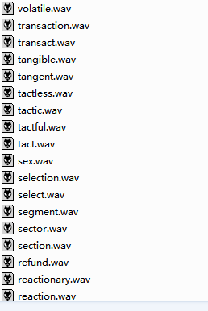
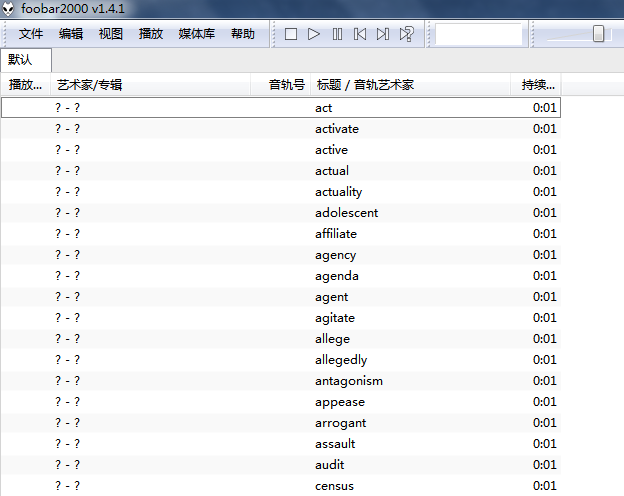

# Words-Dictation
使用Qt做的单词听写软件，基于语音合成技术

## 说明
Qt版本是5.12.0，编译器是MSVC2017 64bit，编译后，运行之前将source\dll文件夹下的动态链接库文件放到程序生成目录底下。如：build-Words-Dictation-desktop_Qt_5_12_0_MSVC2017_64bit-Debug\debug

将msc文件夹放到构建目录下（msc文件夹下里是离线语音合成引擎文件）

## 项目目录说明

## 截图

* 界面显示

* 选择文件

* 自主选择发音人

* 选择听写间隔时间

* 文本显示

* 音频生成示例

* 利用外部播放器播放示例

## 博客

附上我的博客主页，项目完成后，会更新博客

[博客主页](https://blog.csdn.net/qq_37224534)